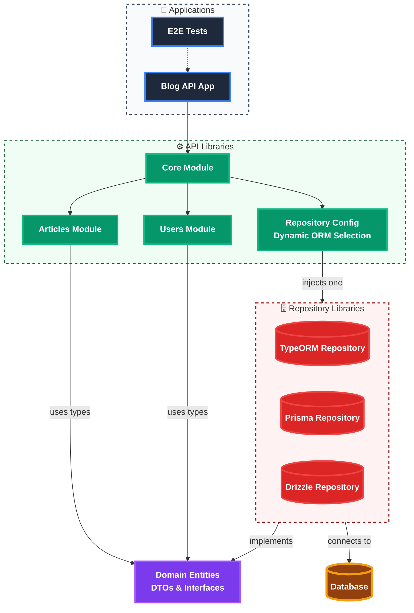
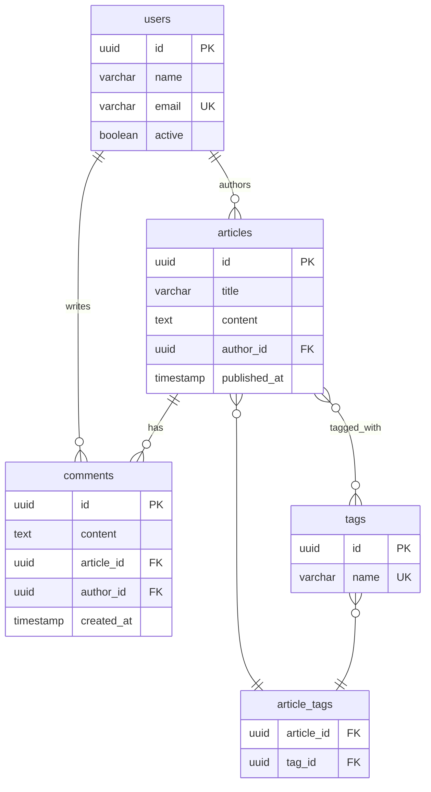
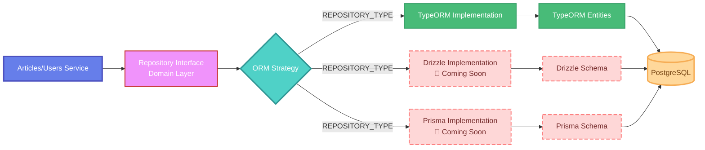

# ORM Showcase Architecture

## Service Architecture Diagram

## Database Schema Relationships

## ORM Strategy Pattern

## Key Features

- **Multi-ORM Support**: Pluggable repository pattern allowing different ORM implementations
- **Clean Architecture**: Separation of concerns with domain, application, and infrastructure layers
- **NestJS Framework**: Enterprise-grade Node.js framework with dependency injection
- **PostgreSQL Database**: Relational database with UUID primary keys
- **Docker Support**: Containerized database setup
- **Validation**: Request validation using class-validator
- **OpenAPI Specification**: Complete API documentation

## Environment Configuration

The application uses environment variables to determine which ORM implementation to use:

- `REPOSITORY_TYPE=typeorm` - Uses TypeORM (currently implemented)
- `REPOSITORY_TYPE=drizzle` - Will use Drizzle (planned)
- `REPOSITORY_TYPE=prisma` - Will use Prisma (planned)
